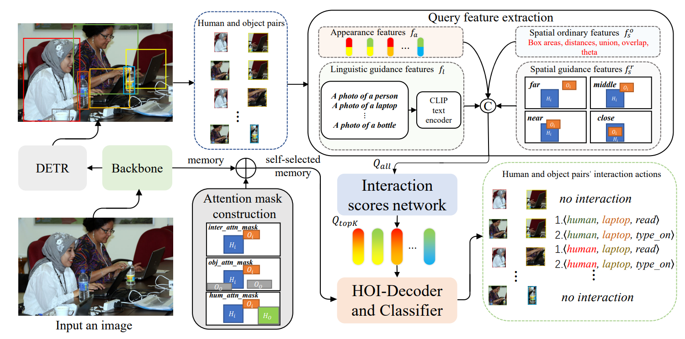

## [ICASSP 2023] SQA: Strong Guidance Query with Self-Selected Attention for Human-Object Interaction Detection

* [Paper](https://ieeexplore.ieee.org/abstract/document/10096029)

<p align="center"></p>

## Installation

### 1. Environmental Setup
```bash
$ conda create -n SQA python=3.7
$ conda install -c pytorch pytorch torchvision # PyTorch 1.7.1, torchvision 0.8.2, CUDA=11.0
$ conda install cython scipy
$ pip install pycocotools
$ pip install opencv-python
$ pip install wandb
```
You should also download [CLIP](https://github.com/openai/CLIP).

### 2. HOI dataset setup
Our SQA supports the experiments for both [V-COCO](https://github.com/s-gupta/v-coco) and [HICO-DET](https://drive.google.com/file/d/1QZcJmGVlF9f4h-XLWe9Gkmnmj2z1gSnk/view) dataset.
Download the dataset under the pulled directory.
For HICO-DET, we use the [annotation files](https://drive.google.com/file/d/1QZcJmGVlF9f4h-XLWe9Gkmnmj2z1gSnk/view) provided by the PPDM authors.
Download the [list of actions](https://drive.google.com/open?id=1EeHNHuYyJI-qqDk_-5nay7Mb07tzZLsl) as `list_action.txt` and place them under the unballed hico-det directory.
Below we present how you should place the files.
```bash
# V-COCO setup
$ git clone https://github.com/s-gupta/v-coco.git
$ cd v-coco
$ ln -s [:COCO_DIR] coco/images # COCO_DIR contains images of train2014 & val2014
$ python script_pick_annotations.py [:COCO_DIR]/annotations

# HICO-DET setup
$ tar -zxvf hico_20160224_det.tar.gz # move the unballed folder under the pulled repository

# dataset setup
SQA
 │─ v-coco
 │   │─ data
 │   │   │─ instances_vcoco_all_2014.json
 │   │   :
 │   └─ coco
 │       │─ images
 │       │   │─ train2014
 │       │   │   │─ COCO_train2014_000000000009.jpg
 │       │   │   :
 │       │   └─ val2014
 │       │       │─ COCO_val2014_000000000042.jpg
 :       :       :
 │─ hico_20160224_det
 │       │─ list_action.txt
 │       │─ annotations
 │       │   │─ trainval_hico.json
 │       │   │─ test_hico.json
 │       │   └─ corre_hico.npy
 :       :
```~~~~

If you wish to download the datasets on our own directory, simply change the 'data_path' argument to the directory you have downloaded the datasets.
```bash
--data_path [:your_own_directory]/[v-coco/hico_20160224_det]
``` 

### 3. Training/Testing on V-COCO

```shell
python main.py --validate \
    --num_hoi_queries 32 --batch_size 4 --lr 5e-5 --HOIDet --hoi_aux_loss --no_aux_loss \ 
    --dataset_file vcoco  --data_path v-coco --detr_weights https://dl.fbaipublicfiles.com/detr/detr-r50-e632da11.pth \
    --output_dir checkpoints/vcoco --group_name SQA --run_name vcoco_run1
```

* Add `--eval` option for evaluation

### 4. Training/Testing on HICO-DET

Training with pretrained DETR detector on COCO.
```shell
python main.py --validate \ 
    --num_hoi_queries 32 --batch_size 4 --lr 5e-5 --HOIDet --hoi_aux_loss --no_aux_loss \
    --dataset_file hico-det --data_path hico_20160224_det --detr_weights https://dl.fbaipublicfiles.com/detr/detr-r50-e632da11.pth \
    --output_dir checkpoints/hico-det --group_name SQA --run_name hicodet_run1
```

Jointly fine-tune object detector & HOI detector
```shell
python main.py --validate \
    --num_hoi_queries 32 --batch_size 2 --lr 1e-5 --HOIDet --hoi_aux_loss \
    --dataset_file hico-det --data_path hico_20160224_det \
    --output_dir checkpoints/hico-det --group_name SQA --run_name hicodet_run1/jointly-tune \
    --resume checkpoints/hico-det/SQA/best.pth --train_detr
```


## Visualization

* If you want to visualize the detection results and the attention heat map, add `--resume /directory of checkpoint, such as: checkpoints/hico-det/SQA/best.pth` ,`--demo` and `--img_file /directory of images`.


## Acknowledgement

This repo is based on [DETR](https://github.com/facebookresearch/detr), [HOTR](https://github.com/kakaobrain/HOTR), [STIP](https://github.com/zyong812/STIP), [CLIP](https://github.com/openai/CLIP). Thanks for their wonderful works.


## Citation

If you find this code helpful for your research, please cite our paper.
```
@inproceedings{zhang2023sqa,
  title={SQA: Strong Guidance Query with Self-Selected Attention for Human-Object Interaction Detection},
  author={Zhang, Feng and Sheng, Liu and Guo, Bingnan and Chen, Ruixiang and Chen, Junhao},
  booktitle={ICASSP 2023-2023 IEEE International Conference on Acoustics, Speech and Signal Processing (ICASSP)},
  pages={1--5},
  year={2023},
  organization={IEEE}
}
```
